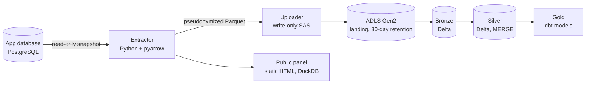

# MeuInglês data platform

Data pipeline behind [MeuInglês](https://meuingles.wellgois.com/), a spoken-English trainer for data engineers.
Every practice attempt (pronunciation scores per word and phoneme, durations, plan, signup source) becomes data for
this pipeline. The app lives in the repository root; this folder holds everything downstream of its PostgreSQL database.

Live output: the [public evolution panel](https://meuingles.wellgois.com/evolucao/) (owner data only).

## Architecture



## Status

| Layer | Status |
|---|---|
| Extract + pseudonymize | Scheduled daily (cron, 03:30 Brasília) |
| Upload to ADLS Gen2 landing | Scheduled daily; lifecycle rule deletes landing files after 30 days |
| Bronze and silver (Delta, Spark) | Implemented, 8 tests in CI on local Spark. Databricks job not provisioned yet |
| Gold (dbt) | 6 models and 17 data tests, running on DuckDB in CI. Databricks target prepared, not exercised yet |
| Orchestration | cron in production. Airflow DAG tested in CI, not deployed |
| Public panel | Live: static page built daily from the extract |
| Azure Data Factory | Not provisioned |

## What each layer does

- **Extractor** (`extractor/`): one read-only, consistent snapshot of PostgreSQL per run. Daily partitions (`dt=`) for
  attempts, words, phonemes and visits; snapshots for users, review items and deleted accounts. Quality checks run
  before anything is written, and files are replaced atomically. Each run leaves a manifest in `_runs/`.
- **Uploader** (`extractor/upload.py`): sends only an allow-list of paths (Parquet files and run manifests) with a
  write-only SAS URL (create/write permissions, HTTPS only, IP-restricted, with an expiry date).
- **Bronze** (`lake/jobs.py`): copy of landing in Delta. Each run replaces only the partitions of a date window.
- **Silver** (`lake/silver.py`): typed, deduplicated tables written with an idempotent `MERGE`; local dates in
  America/Sao_Paulo. Quality gates fail the job instead of letting bad data through.
- **Gold** (`dbt/`): daily progress per user, hardest phonemes, days to advance a level, signup funnel by
  source and campaign, weekly retention, and a daily cost model.
- **Public panel** (`panel/`): static HTML with SVG charts, no JavaScript, built with DuckDB straight from the extract.

## Design decisions

1. **Landing is disposable.** PostgreSQL is the source of truth, so `extract --since` rebuilds it, and a lifecycle
   rule deletes landing files after 30 days.
2. **Bronze never does a full reload.** It replaces only the window being ingested (`replaceWhere`), so history
   survives the landing retention.
3. **Everything is idempotent and tested that way**: window replace in bronze, `MERGE` on business keys in silver.
4. **Account deletion reaches the lake.** A PostgreSQL trigger records the user in `deleted_users`; bronze and silver
   delete everything that belongs to those users (children first) and re-apply it on every run, so reprocessing old
   files cannot bring a deleted account back.
5. **Pseudonyms are HMAC-SHA256** with a key held only on the server. Rotating the key breaks linkage, so the whole
   lake would be rebuilt from PostgreSQL.
6. **Free text never leaves the database**: no transcripts, LLM feedback, raw JSON, names or e-mails.
7. **Quality gates stop the pipeline**: extractor checks (formats, ranges, unique keys, orphan rows), silver gates
   (scores 0-100, levels 1-5, known engines, orphan words and phonemes) and dbt tests.
8. **dbt runs on DuckDB first.** A free local loop, with expected values computed by hand and checked in CI. Only two
   macros differ for Spark SQL (`days_between`, `week_start`); the Databricks target is ready.
9. **Orchestration stays on cron for now.** The VPS also hosts production apps, and the official Airflow Docker Compose
   file is a quick-start setup. The DAG is tested in CI and runs the pipeline over SSH with a key restricted to a
   script that accepts only `extract` and `upload`. Airflow is started on demand.
10. **CI cannot go falsely green.** Jobs that need optional dependencies fail when tests are skipped (`FAIL_ON_SKIP`).

## Privacy

No audio is stored. The public panel shows the owner's data only, and tests plant another user's data and a `<script>`
string to prove it never reaches the page. The privacy policy discloses the pseudonymized analytics copy in Azure.

## Cost control

An Azure budget alert watches the subscription; the gold layer models daily cost (assessed audio and LLM tokens).
The Databricks workspace is not upgraded yet, to avoid idle spending; the planned job is a single-node job cluster
that terminates on its own.

## Run it

```bash
./run_extract.sh        # Postgres -> pseudonymized Parquet (needs the pseudonymization key)
./run_upload.sh         # Parquet -> ADLS Gen2 landing (needs the write-only SAS URL)
./run_panel.sh          # public evolution panel (static HTML)
./run_gold_local.sh     # landing -> bronze -> silver (Spark/Delta) -> DuckDB -> dbt gold, all local
./run_daily.sh          # what cron runs: extract, upload, panel, failure alert
```

Tests: `pytest` in this folder (extractor, uploader, panel, orchestration), `tests/lake` (needs Java and Spark),
`tests/gold` (dbt on DuckDB). CI runs them as separate jobs.

## Roadmap

1. Upgrade the Databricks workspace, run bronze and silver as a job, register silver in Unity Catalog and run dbt
   with the Databricks target.
2. Add Azure Data Factory and compare it with the Airflow DAG using measured results.
3. Alerting beyond the e-mail on pipeline failure.
